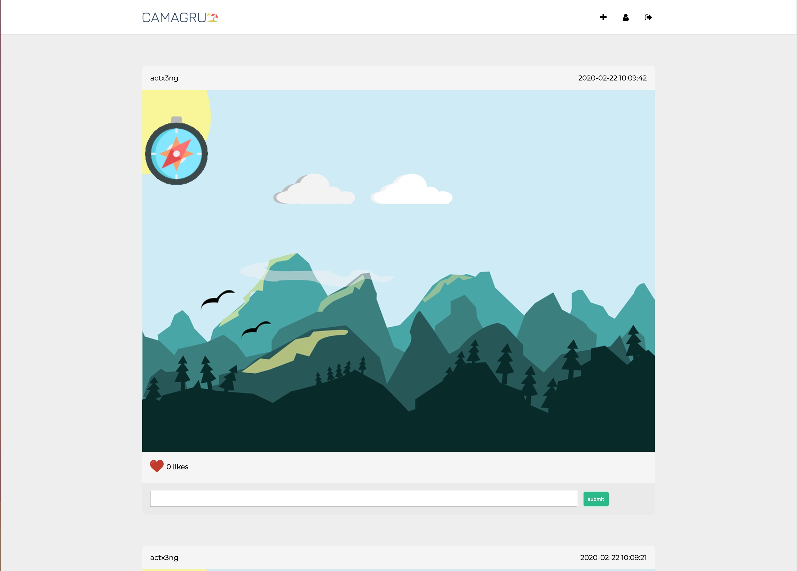
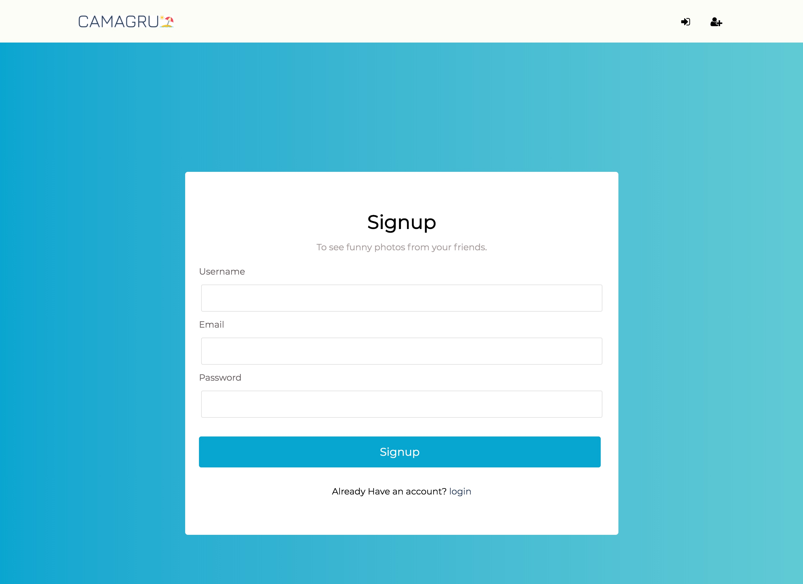
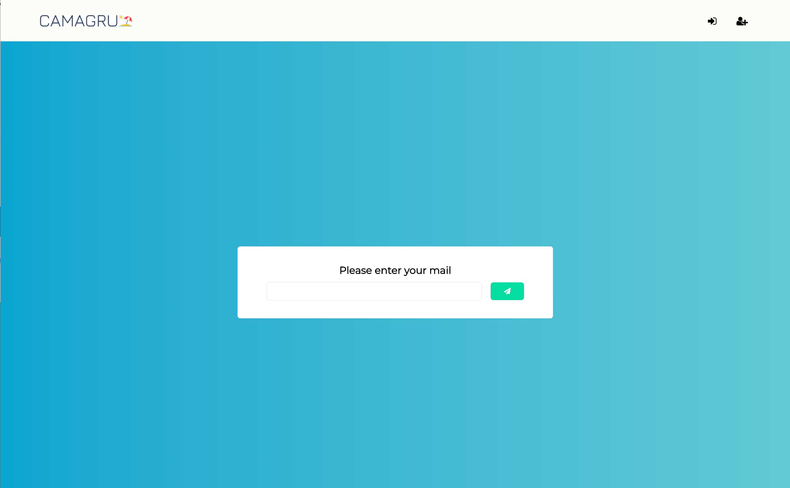
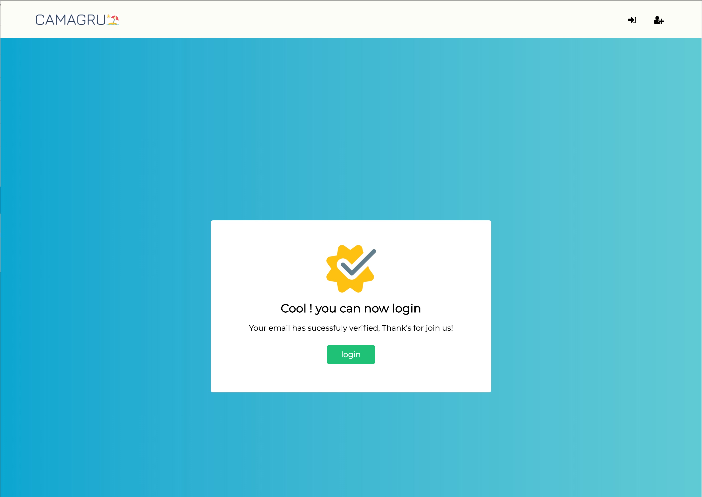
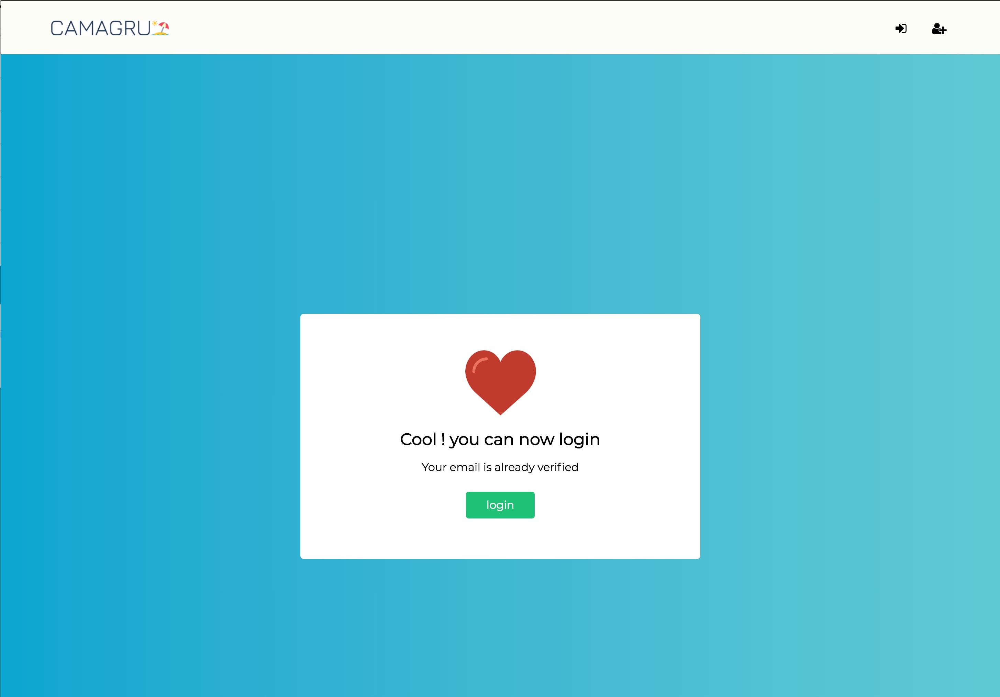
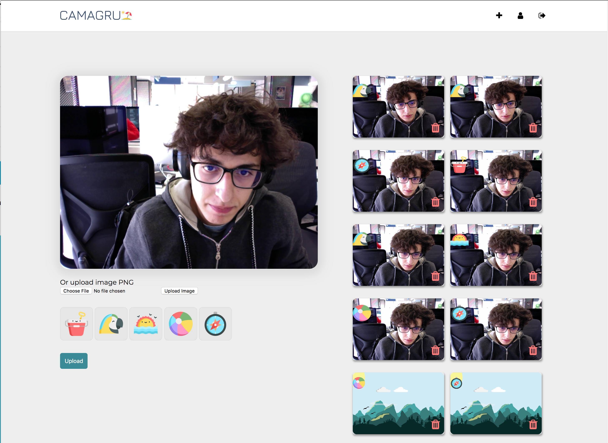
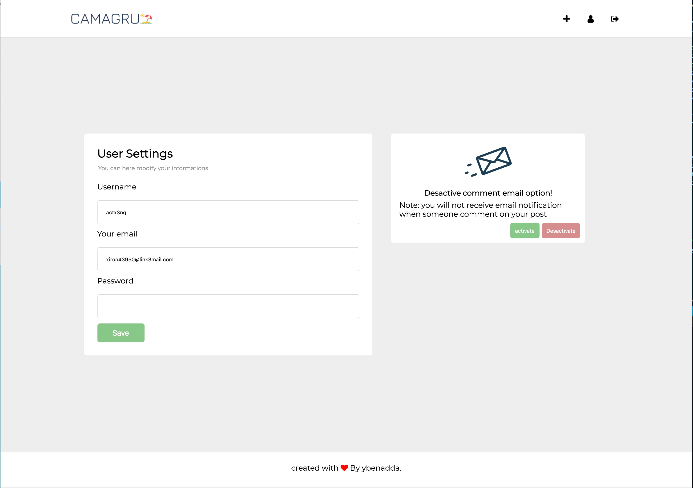

# Camagru 📸

Web application allowing to make basic photo and video editing using webcam and some predefined images and the user can show his/her images publicly and there is a like and comment system like (instagram).

## 👉 Description 

The application allows a user to sign up by asking a valid email address,username and password , at the end of the registration process a user should Confirm his account via a unique link sent at the email address fulfilled in the Registration form. The user should be able to connect to the application, using his username and His password. He also able to tell the application to send a password Reinitialisation mail, if he forgets his password Once connected, a user should modify his username, mail address or password. There is a Gallery page and it’s public that display all images edited by all the users And it allows only a connected user to like them or comment on them. The list of images is paginated. The editing page contains a main section that show the preview of user’s Webcam, the list of superposable images and a button allowing to capture a Picture also a side section displaying thumbnails an all previous pictures taken.

## ⚙️ Used Technologies
💅 FrontEnd   : HTML5, CSS3, Javascript

🛠 Backend    : PHP7

💾 Database   : MySql

☁️ Deployment : Docker, Github

## 📸 App Screenshots

### ▪️ login Page 

### ▪️ Signup Page

### ▪️ Reset Password Page

### ▪️ Email Verification 

### ▪️ Account Already verified

### ▪️ Gallery Page

### ▪️ Camera Page

### ▪️ User Settings Page

Made with ❤️ @ 1337 School